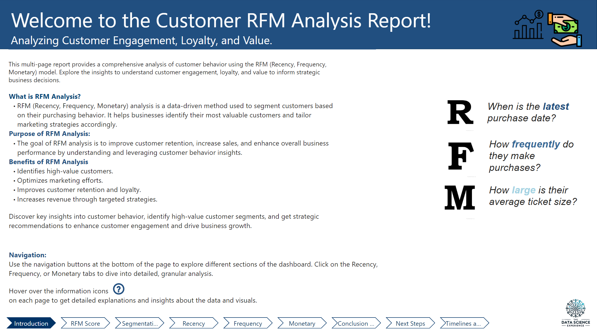
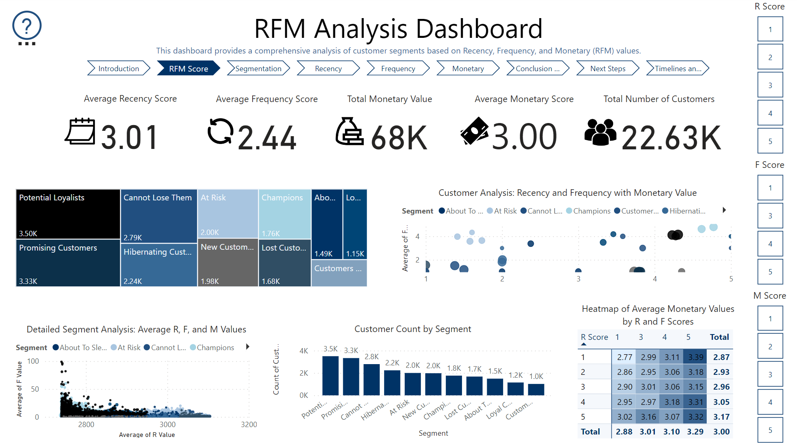
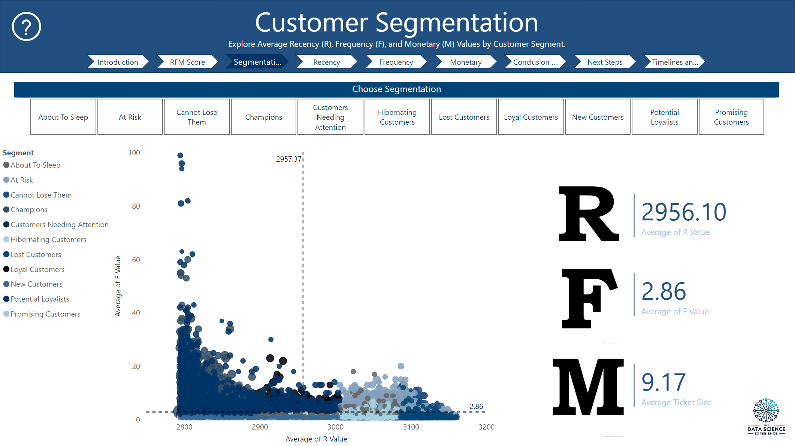
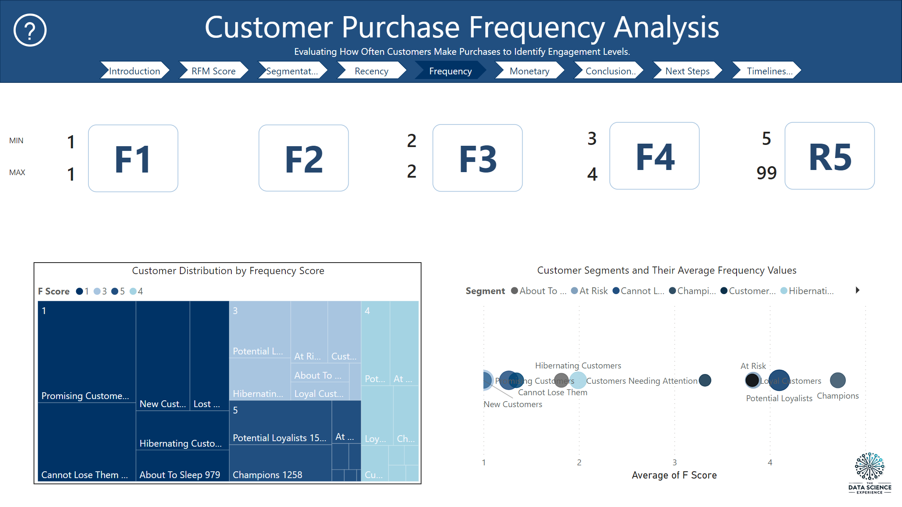
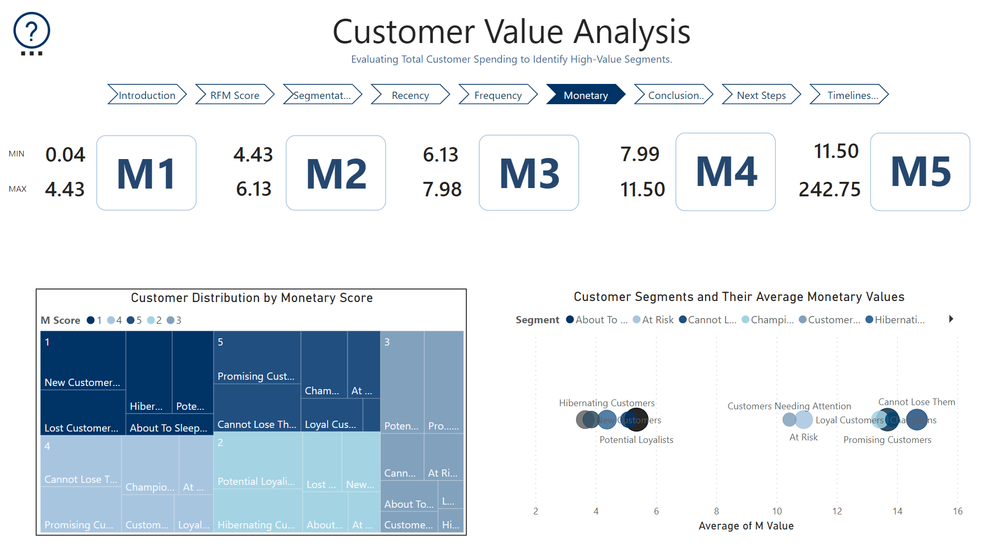
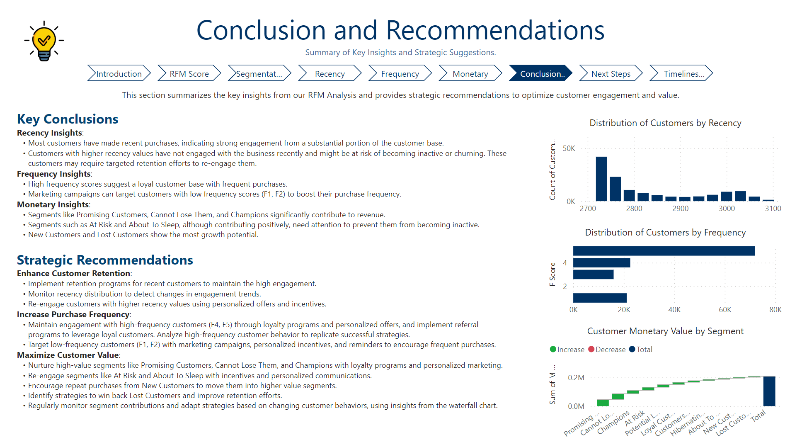
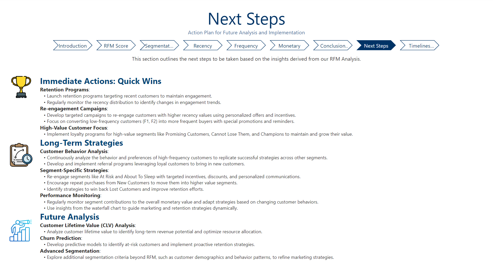
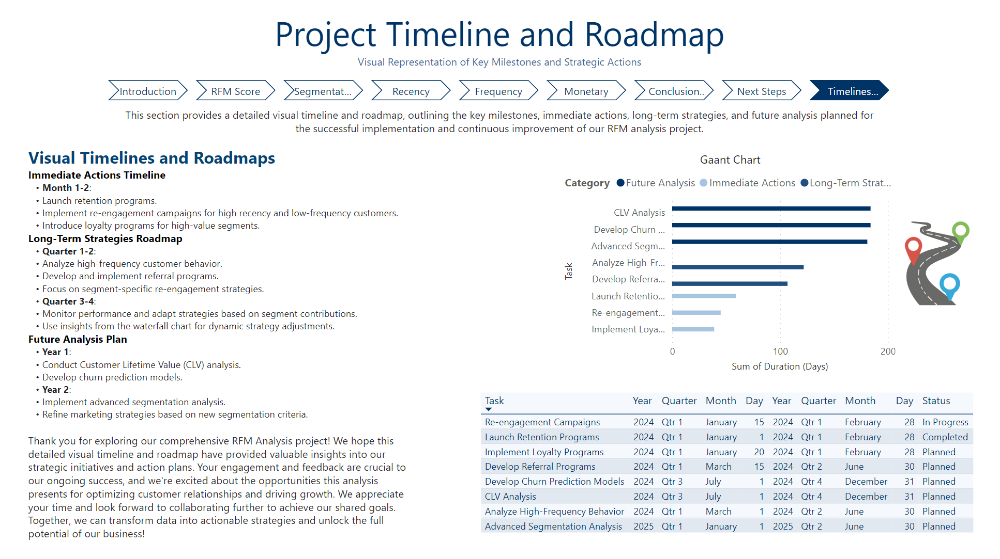

# Power BI RFM Analysis Multi-Page Report

## Executive Overview
Welcome to the Customer RFM (Recency, Frequency, Monetary) Analysis Project! This initiative provides comprehensive insights into customer behavior, engagement, and value, showcasing the power of RFM analysis. This project demonstrates how to drive targeted marketing strategies, enhance customer retention, and maximize business profitability by understanding and segmenting customers. Key features include the use of DAX expressions for precise calculations, interactive visualizations with dynamic filters and tooltips for an enhanced user experience, and a thorough data analysis with actionable recommendations. Additionally, a fictionalized timeline and roadmap outline the proposed steps for implementation.

## Table of Contents
- [Technologies Used](#technologies-used)
- [Data Source](#data-source)
- [Features](#features)
- [Business Question](#business-question)
- [Methodology](#methodology)
- [Business Question Specific Insights and Recommendations](#business-question-specific-insights-and-recommendations)
- [Stakeholder Recommended Next Steps](#stakeholder-recommended-next-steps)
- [Recommendations for Future Analysis](#recommendations-for-future-analysis)
- [Contact](#contact)
- [Screenshots](#screenshots)

## Technologies Used
- **Power BI**: For creating multi-page interactive dashboards and reports.
  - **Advanced DAX Formulas**: Utilized for complex calculations and custom metrics.
  - **Data Modeling**: Ensured accurate relationships and calculations across tables.
  - **Power Query**: Used for data transformation and cleaning.
  - **Interactive Visualizations**: Implemented dynamic filters, tooltips, and engaging charts.

## Data Source
Our data comes from retail store sales transactions available on Kaggle. [The anonymized dataset](https://www.kaggle.com/datasets/marian447/retail-store-sales-transactions?resource=download) includes 64.682 transactions of 5.242 SKU's sold to 22.625 customers during one year.

## Features
- **Interactive Visualizations:** Engaging and interactive charts and graphs to deeply explore various customer segments.
- **RFM Segmentation:** Detailed breakdown of customers based on Recency, Frequency, and Monetary values.
- **Tooltips and Annotations:** Comprehensive explanations and insights are available through interactive tooltips on each page.
- **Dynamic Filters:** Slicers enabling data filtering based on R, F, and M scores for tailored analysis.
- **Comprehensive Analysis:** Dedicated pages for each aspect of RFM, including a thorough segment analysis, conclusions, and business recommendations.

## Business Question
**"How can we optimize our marketing budget by focusing on the highest ROI segments identified in the RFM analysis, while simultaneously addressing the needs of low-frequency and at-risk customers to maximize overall customer lifetime value?"**

## Methodology
An RFM (Recency, Frequency, Monetary) analysis will be performed to answer this business question. RFM analysis is a proven technique that segments customers based on how recently they made a purchase, how often they purchase, and how much they spend. This approach allows businesses to identify their most valuable customers and tailor marketing efforts to maximize ROI.

By using RFM analysis, we can prioritize marketing spend on high-value segments that are likely to deliver the greatest returns while also developing strategies to re-engage low-frequency and at-risk customers. This ensures that marketing efforts are both efficient and effective in enhancing customer retention and maximizing lifetime value.

## Business Question Specific Insights and Recommendations:
1. **Customer Segment by Revenue:**
- **Oberservation:** High-value segments, such as Promising Customers, Cannot Lose Them, and Champions, significantly contribute to the overall revenue. These segments demonstrate strong engagement and loyalty, making them crucial for sustaining and growing revenue.
- **Actionable Insight:** Allocate a larger portion of the marketing budget to personalized loyalty programs, targeted offers, and retention strategies for these high-value segments. This will ensure that these customers remain engaged and continue contributing positively to the revenue.

2. **Customer Segment by Frequency and Engagement:**
- **Observation:** Low-frequency customers (F1, F2) have lower engagement levels, presenting an opportunity to boost their purchase frequency through targeted marketing efforts. Additionally, segments like At Risk and About To Sleep, while still contributing positively, are at risk of becoming inactive.
- **Actionable Insight:** Implement targeted marketing campaigns with personalized incentives for low-frequency customers to encourage more frequent purchases. Re-engage at-risk segments with specialized retention efforts, such as discounts, personalized communication, and tailored offers, to prevent churn and enhance customer lifetime value.

3. **Growth Potential of Customer Segments:**
- **Observation:** The RFM analysis reveals that New Customers and Lost Customers segments show growth potential, yet they are not fully leveraged.
- **Actionable Insight:** Invest in strategies to nurture New Customers, moving them into higher value segments over time. Develop win-back campaigns aimed at Lost Customers to regain their business, focusing on addressing their previous pain points and offering compelling incentives.

## Stakeholder Recommended Next Steps

### Immediate Actions: Quick Wins

**Focus on High-Value Customers:**
- **Loyalty Initiatives:** Allocate a larger portion of the marketing budget to personalized loyalty programs, targeted offers, and retention strategies for high-value segments such as Promising Customers, Cannot Lose Them, and Champions. This will help maintain their engagement and ensure continued positive contributions to revenue.

**Reactivation Campaigns:**
- **Low-Frequency Customer Engagement:** Implement targeted marketing campaigns with personalized incentives aimed at low-frequency customers (F1, F2) to boost their purchase frequency.
- **Retention of At-Risk Segments:** Re-engage at-risk segments, like About To Sleep and At Risk, with specialized retention efforts, such as discounts, personalized communication, and tailored offers, to prevent churn and enhance customer lifetime value.

### Long-Term Strategies

**Nurture Growth Potential:**
- **New Customer Development:** Invest in strategies to nurture New Customers, aiming to move them into higher-value segments over time.
- **Lost Customer Win-Back:** Develop win-back campaigns targeting Lost Customers, focusing on addressing their previous pain points and offering compelling incentives to regain their business.

**Segment-Specific Insights:**
- **Behavioral Analysis:** Continuously study the behaviors and preferences of high-frequency and high-value segments to refine and replicate successful strategies across other segments.
- **Enhanced Engagement:** Encourage new and existing customers to make repeat purchases, transitioning them into higher-value segments.

**Monitoring and Adaptation:**
- **Dynamic Strategy Adjustment:** Regularly assess the contributions of different customer segments to the overall revenue and adjust marketing and retention strategies based on evolving customer behaviors and insights.

## Recommendations for Future Analysis
- **Customer Lifetime Value (CLV) Evaluation:** Conduct an in-depth analysis of customer lifetime value to pinpoint long-term revenue potential and optimize the allocation of resources accordingly.
- **Churn Prediction:** Develop predictive models to identify customers at risk of churning and implement proactive retention strategies to mitigate this risk.
- **Enhanced Segmentation:** Investigate additional segmentation criteria beyond RFM, including customer demographics and behavior patterns, to refine and enhance marketing strategies.

## Contact
For more information, please contact:

**Name:** Matt Delaune

**Email:** matt.delaune@gmail.com

## Screenshots

*Dashboard Overview Page*

*RFM Dashboard*

*Customer Segmentation*

*Recency Analysis Page*

*Frequency Analysis Page*

*Monetary Analysis Page*

*Conclusion and Recommendations*

*Next Steps*

*Project Timeline and Roadmap*
